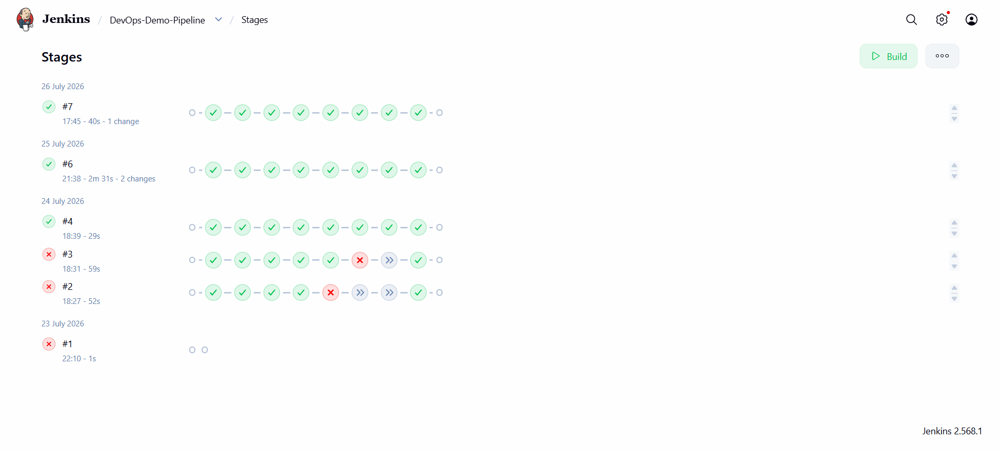
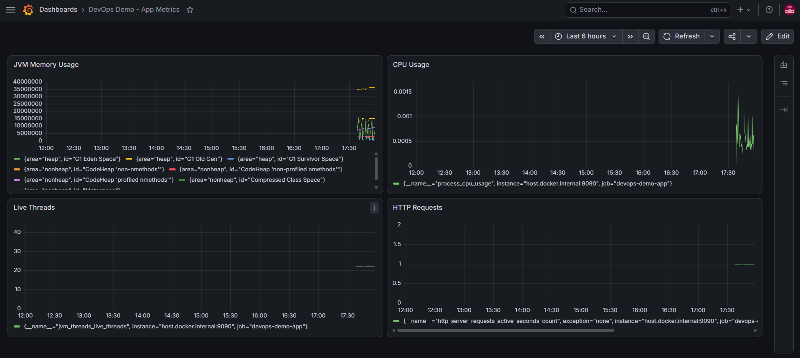

# DevOps CI/CD Pipeline — Automated Web Application Deployment

A fully automated CI/CD pipeline that takes a Spring Boot web application from source code to a running, monitored container — triggered automatically on every `git push`.

## Problem Statement

Conventional deployment processes for web applications are time-consuming and manual, hindering productivity and failing to meet customer expectations for fast, reliable software delivery. This project implements a DevOps-based CI/CD pipeline to automate build, test, and deployment, reducing deployment time and improving overall release consistency.

## Architecture

```
Developer pushes code to GitHub
        │
        ▼
GitHub Webhook triggers Jenkins
        │
        ▼
Jenkins Pipeline:
  1. Checkout      → pulls latest code
  2. Build         → Maven compiles the app
  3. Test          → runs unit tests
  4. Docker Build  → packages app into a container image
  5. Docker Push   → publishes image to Docker Hub
  6. Deploy        → runs the new container, replacing the old one
        │
        ▼
Live application + Prometheus/Grafana monitoring
```

## Tech Stack

| Layer               | Tool                                               |
| ------------------- | -------------------------------------------------- |
| Application         | Spring Boot (Java 17)                              |
| Build tool          | Maven                                              |
| Source control      | GitHub                                             |
| CI/CD orchestration | Jenkins                                            |
| Containerization    | Docker (multi-stage build)                         |
| Image registry      | Docker Hub                                         |
| Monitoring          | Prometheus + Grafana                               |
| Auto-trigger        | GitHub Webhook (via ngrok tunnel to local Jenkins) |

## Features

- **Fully automated pipeline** — a single `git push` triggers build, test, containerization, and deployment with zero manual intervention
- **Multi-stage Docker build** — keeps the final image lean by separating build tools from the runtime image
- **Live monitoring dashboard** — JVM memory, CPU usage, live threads, and HTTP request metrics visualized in real time via Grafana
- **Health checks** — Spring Boot Actuator exposes `/actuator/health` and `/actuator/prometheus` endpoints

## Endpoints

| Endpoint               | Description                     |
| ---------------------- | ------------------------------- |
| `/hello`               | Basic status check              |
| `/version`             | App version info                |
| `/actuator/health`     | Health check                    |
| `/actuator/prometheus` | Metrics for Prometheus scraping |

## Pipeline in Action



## Monitoring Dashboard



## Impact

Replaces a multi-step manual deployment process (build → test → containerize → push → run, each done by hand) with a single automated flow — reducing deployment time and eliminating manual error, directly addressing the productivity and reliability goals of the original problem statement.

## Local Setup

1. Clone this repo
2. Build and run locally: `mvn spring-boot:run`
3. Or build the Docker image: `docker build -t devops-demo .` then `docker run -p 8080:8080 devops-demo`
4. The full pipeline (Jenkins, Prometheus, Grafana) requires additional setup — see `Jenkinsfile` for pipeline stages and `prometheus.yml` for monitoring config

## Future Enhancements

- Kubernetes-based deployment for scalability
- Slack/email notifications on pipeline success/failure
- Staging vs. production environment separation
